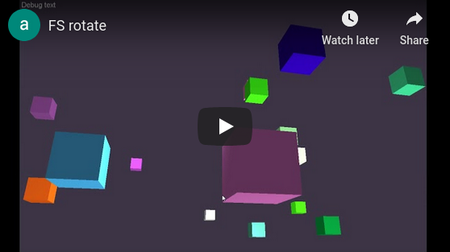
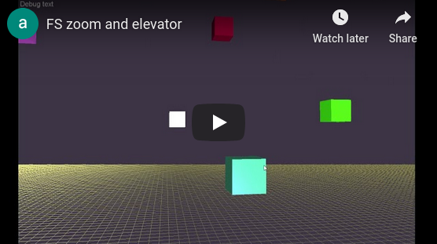

# FSEngine | a 3D C++ game engine

Greetings. This is **FSEngine** - an unfinished and unsupported game engine. It is built with C++, OpenGL, SDL, and love. It's only compatible with Visual Studio, and I never got around to adding a `Makefile`, so the dependencies need to be cared for manually.

## It sure does render!

Here's a spaceman suit dude from Crysis, apparently. I didn't make this. 

A spaceship from *Nintendo Game* with some colored cube primitives that **I made**.

## Camera demos
Cameras are hard, but the **FSEngine** camera *"just works."*

Pan around by holding the middle-mouse button and moving the cursor.

The scroll-wheel zooms the scene in-and-out. You can also use alt+scroll to perform ***Elevator Movement™*** - A revolutionary new technique to maneuver the scene up-and-down.
