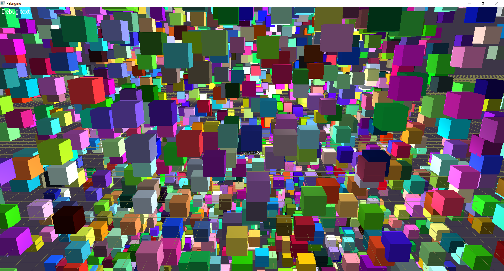
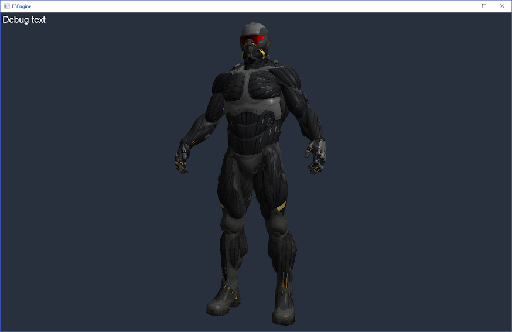
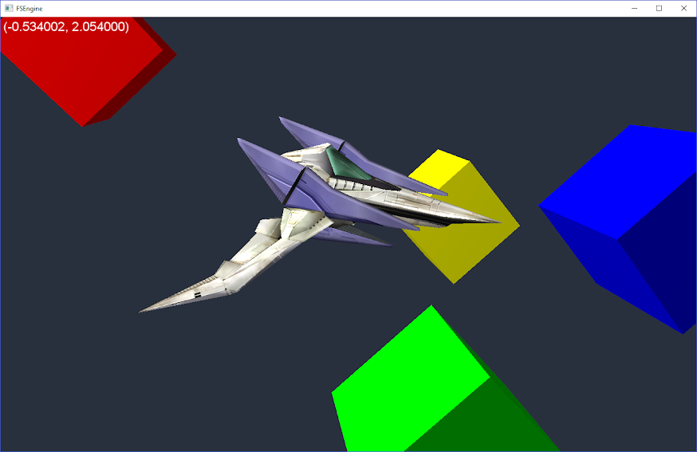

# FSEngine

Greetings. This is my unfinished and unsupported 3D game engine. It is built with C++, OpenGL, SDL, and love. It's only compatible with Visual Studio, and I never got around to adding a `Makefile`, so the dependencies need to be cared for manually.

## It sure does render!

Here's a spaceman suit dude from Crysis, apparently. I didn't make this. 

A spaceship from **Nintendo Game** with some colored cube primitives that **I made**.
